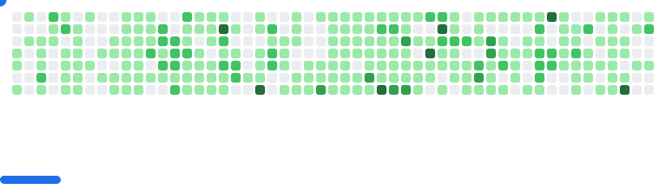

<div align="center">

<!-- Dynamic typing animation -->


<br/>

<!-- Profile views counter -->


</div>

---

## 🚀 About Me

```typescript
const adeel = {
    role: "Full Stack Developer & Linux Enthusiast",
    location: "Bangladesh 🇧🇩",
    focus: ["Web Development", "System Optimization", "Open Source"],
    currentlyWorking: "Code Moft - Developer Hub & Learning Platform",
    learning: ["Advanced React Patterns", "System Architecture", "DevOps"],
    askMeAbout: ["React", "Next.js", "Linux", "Web Performance", "Docker"],
    funFact: "I optimize code like I optimize my Linux setup - obsessively! 🐧"
};
```

### 💼 What I Bring to the Table

- **🎯 Problem Solver**: Transform complex requirements into elegant, maintainable solutions
- **⚡ Performance Focused**: Optimization is not optional - it's a lifestyle
- **🛠️ Tool Builder**: Create developer tools that save hours of manual work
- **📚 Knowledge Sharer**: Active in creating tutorials and documentation for the community
- **🔄 Continuous Learner**: Always exploring new technologies and best practices

---

## 🛠️ Tech Stack & Tools

<div align="center">

### Languages & Frameworks


### Frontend & Styling


### Backend, Database & DevOps


</div>

---

## 🔥 Featured Projects

<!--  ★  FLAGSHIP  ★  -->

<div align="center">

## ⚔️ CodeArena

### Full-Stack Online Judge & Competitive Programming Platform


&nbsp;

&nbsp;

&nbsp;


</div>

> A **production-grade competitive programming platform** built from the ground up as a 6-person team project. Users can browse problems, write and submit code in a Monaco editor, and get instant verdicts — powered by a real Docker sandboxed execution engine.

| Feature | Details |
|---|---|
| 🧑‍⚖️ **Online Judge** | Submits code to isolated Docker containers, evaluates against test cases, returns 10 possible verdicts |
| 🌐 **Multi-language** | C++, Python, Java, JavaScript — each with a dedicated executor Docker image |
| 🏆 **Contests** | Timed competitions with participant registration, live leaderboards & penalty scoring |
| 🔐 **Auth System** | Firebase + JWT dual-layer — HttpOnly cookie sessions protect against XSS |
| 🤖 **AI Integration** | Google Gemini & Groq SDK for intelligent platform features |
| ⚡ **Real-time** | Socket.IO + Redis adapter layer for live updates |
| 🛡️ **Security** | Docker socket proxied through `tecnativa/docker-socket-proxy` — restricted to safe APIs only |
| 📊 **Monitoring** | Prometheus-compatible metrics via `prom-client` |

**Stack:** `Next.js 16` · `React 19` · `Tailwind CSS v4` · `MongoDB` · `Redis` · `BullMQ` · `Docker + dockerode` · `Firebase Auth` · `JWT` · `Socket.IO` · `Monaco Editor` · `Three.js` · `Framer Motion` · `GSAP` · `Zod` · `SWR` · `Zustand`

<div align="center">

[](https://github.com/rabiulislam5334/CodeArena-TeamProject)
&nbsp;&nbsp;
[](https://codearena-team.up.railway.app)

</div>

---

### 🗂️ More Projects

<table>
  <tr>
    <td width="50%">
      <h3 align="center">👓 Metro Optics</h3>
      <p align="center">
        
        
        
      </p>
      <p align="center">
        A full-featured e-commerce platform for premium eyewear with prescription management, real-time inventory, and a role-based admin panel — all synced live via Firebase.
      </p>
      <p align="center">
        <strong>Tech:</strong> React 19, Firebase, Tailwind CSS, Vite, Radix UI, Zod
      </p>
      <p align="center">
        <a href="https://github.com/mdadeel/metro-optics"></a>
        &nbsp;
        <a href="https://metro-optics.vercel.app"></a>
      </p>
    </td>
    <td width="50%">
      <h3 align="center">⚡ React App Setup Tool</h3>
      <p align="center">
        
        
      </p>
      <p align="center">
        Lightning-fast CLI that scaffolds production-ready React applications with best-practice folder structure, configs, and tooling — saving hours of setup on every new project.
      </p>
      <p align="center">
        <strong>Tech:</strong> Node.js, CLI, Automation Scripts
      </p>
    </td>
  </tr>
  <tr>
    <td width="50%">
      <h3 align="center">🌍 Import Export Hub</h3>
      <p align="center">
        
        
      </p>
      <p align="center">
        A global trade platform where users list products for export, browse international listings, and import items into their personal dashboard with real-time sync.
      </p>
      <p align="center">
        <strong>Tech:</strong> React 19, Node.js, Express, MongoDB, Firebase, Tailwind
      </p>
      <p align="center">
        <a href="https://github.com/mdadeel/iehub-client"></a>
      </p>
    </td>
    <td width="50%">
      <h3 align="center">🎓 e-TuitionBD</h3>
      <p align="center">
        
        
      </p>
      <p align="center">
        A full-scale tuition management platform connecting students with qualified tutors across Bangladesh — covering postings, applications, tutor selection, payments, and admin moderation.
      </p>
      <p align="center">
        <strong>Tech:</strong> React 19, Node.js, Express, MongoDB, Firebase, Stripe, Tailwind, JWT
      </p>
    </td>
  </tr>
  <tr>
    <td width="50%">
      <h3 align="center">🧸 ToyTopia</h3>
      <p align="center">
        
        
      </p>
      <p align="center">
        A premium marketplace for buying and selling used toys in Bangladesh. Explores real-world product flows — listings, profiles, favorites, and payment integration.
      </p>
      <p align="center">
        <strong>Tech:</strong> React, Firebase, Tailwind, DaisyUI, Framer Motion
      </p>
      <p align="center">
        <a href="https://github.com/mdadeel/ToyTopia"></a>
      </p>
    </td>
    <td width="50%">
      <h3 align="center">🏥 Doctoria</h3>
      <p align="center">
        
        
      </p>
      <p align="center">
        A healthcare web application exploring medical platform UI patterns and appointment-flow design. Forked and extended to experiment with patient/doctor interaction flows.
      </p>
      <p align="center">
        <strong>Tech:</strong> HTML, CSS, JavaScript
      </p>
      <p align="center">
        <a href="https://github.com/mdadeel/Doctoria"></a>
      </p>
    </td>
  </tr>
</table>

---

## 🎯 Current Focus

<div align="center">

| 🚀 Building | 📚 Learning | 🤝 Contributing |
|------------|-------------|-----------------|
| Code Moft Platform | Advanced React Patterns | Open Source Projects |
| Developer Tools | System Design & Architecture | Tech Communities |
| System Utilities | Cloud Services & DevOps | Documentation |

</div>

---

## 💡 My Development Philosophy

> **"Code is poetry written for machines to execute and humans to understand"**

- ✨ **Clean Code**: Write code that tells a story
- 🎨 **User-Centric**: Beautiful UX is not optional
- 🚀 **Performance First**: Fast is a feature
- 📖 **Document Everything**: Future you will thank present you
- 🤝 **Community Driven**: Share knowledge, grow together

---

## 📬 Let's Connect!

<div align="center">

[](https://www.linkedin.com/in/shahnawasadee1/)
[](https://github.com/mdadeel)
[](https://mdadeel.vercel.app/)
[](https://www.instagram.com/shahnawas.adeel/)
[](mailto:shahnawasadeel@gmail.com)

### 💬 Open to opportunities and collaborations!

</div>

---

<div align="center">

### 🐍 Contribution Animation

<p align="center">
  <picture>
    <source media="(prefers-color-scheme: dark)" srcset="images/breakout-dark.svg" />
    <source media="(prefers-color-scheme: light)" srcset="images/breakout-light.svg" />
    
  </picture>
</p>

---

**⭐ From [mdadeel](https://github.com/mdadeel) | Built with 💜 and ☕**

</div>
