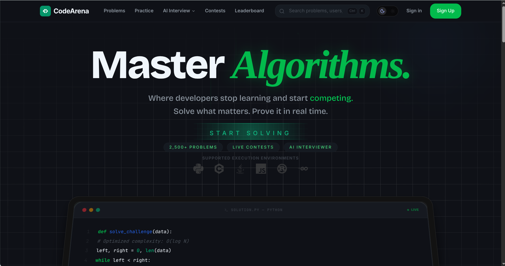
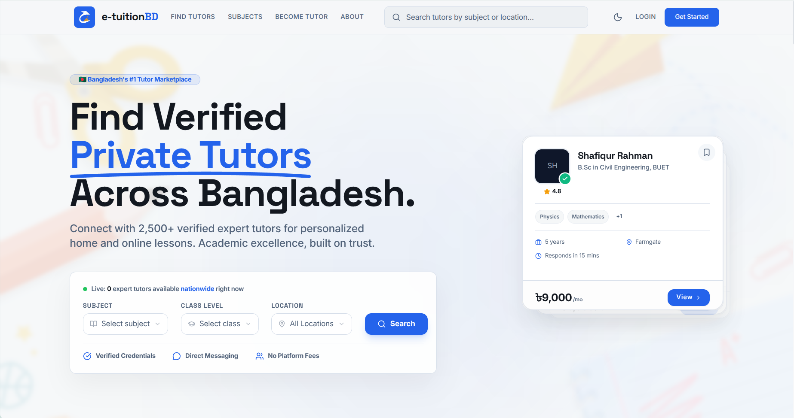

<div align="center">


<br/>


</div>

<p align="center">
  <a href="https://mdadeel.me/">Portfolio</a> •
  <a href="https://www.linkedin.com/in/shahnawasadee1/">LinkedIn</a> •
  <a href="mailto:shahnawasadeel@gmail.com">Email</a>
</p>

<p align="center">
  
  
  
  
  
  
</p>

---

## 🚀 About Me

```typescript
const adeel = {
  role: "Full Stack Developer",

  building: [
    "CodeArena",
    "e-TuitionBD"
  ],

  interests: [
    "Frontend Architecture",
    "Scalable SaaS",
    "Distributed Systems",
    "Developer Experience"
  ],

  currentlyLearning: [
    "System Design",
    "Cloud Infrastructure",
    "AI Engineering"
  ],

  philosophy:
    "Build software that scales technically and delivers a polished user experience."
}
```

## 🧠 Engineering Principles

- Architecture before implementation.
- Performance is a feature.
- Build reusable systems instead of one-off solutions.
- Optimize for maintainability.
- Great UX starts with great engineering.

---

## 🛠️ Tech Stack

### 🖥️ Frontend
<p align="left">
  
  
  
  
  
  
  
  
</p>

### ⚙️ Backend & Database
<p align="left">
  
  
  
  
  
</p>

### 🔧 DevOps & Tools
<p align="left">
  
  
  
  
</p>

---

## 🔥 Featured Projects

### ⚔️ CodeArena
#### Full-Stack Online Judge & Competitive Programming Platform

<div align="center">
  
</div>

<br/>

> A **production-grade competitive programming platform** built from the ground up. Users can browse problems, write and submit code in a Monaco editor, and get instant verdicts powered by an isolated sandboxed execution engine.

#### System Features

| System / Feature | CodeArena Support |
| :--- | :--- |
| **Docker Sandbox** | ✅ Isolated execution of user submissions in secure Docker containers |
| **Real-time Sync** | ✅ Submissions, leaderboard, and contest room sync via Socket.IO & Redis |
| **Contest System** | ✅ Timed competitive coding contests with automatic penalty scoring |
| **AI Integration** | ✅ Interactive AI assistant and smart problem generation using Gemini/Groq |
| **Secured Access** | ✅ Auth with Firebase & HTTPOnly cookie sessions + Docker Socket proxy |
| **Telemetry** | ✅ Live platform metric scraping and monitoring using Prometheus |

**🛠️ Tech Stack:**
- **Frontend:** Next.js 16 • React 19 • Tailwind CSS v4 • Zustand • SWR • Monaco Editor • Framer Motion • GSAP
- **Backend:** Node.js • Express • Redis • BullMQ • Docker (dockerode) • Socket.IO • Firebase Auth • JWT
- **Database:** MongoDB

<div align="center">

[](https://github.com/rabiulislam5334/CodeArena-TeamProject)
&nbsp;&nbsp;
[](https://codearena-pink.vercel.app/)

</div>

---

### 🎓 e-TuitionBD
#### Multi-Tenant EdTech SaaS Marketplace

<div align="center">
  
</div>

<br/>

> A **production-focused EdTech marketplace** connecting students, tutors, parents, and educational organizations on a single platform. Features a scalable multi-tenant architecture and intuitive workflow pipelines.

#### System Features

| System / Feature | e-TuitionBD Support |
| :--- | :--- |
| **Tenant Isolation** | ✅ Scalable multi-tenant architecture with isolated database namespaces |
| **Hiring Pipeline** | ✅ End-to-end tutor discovery, application, booking, and hiring workflow |
| **Granular RBAC** | ✅ Dedicated dashboards and permissions for Admin, Student, Tutor, and Org |
| **Escrow Payments** | ✅ Split commission payment infrastructure integrated securely with Stripe |
| **AI Matching** | ✅ Automated matches between students and ideal tutors using AI algorithms |
| **Community Space** | ✅ Discussion forums, educational resource sharing, and real-time messaging |

**🛠️ Tech Stack:**
- **Frontend:** React 19 • Tailwind CSS • Framer Motion • Socket.IO Client
- **Backend:** Node.js • Express • Redis • Socket.IO • Firebase Auth • JWT • Stripe
- **Database:** MongoDB

<div align="center">

[](https://github.com/mdadeel/etuitionhub-frontend)
&nbsp;&nbsp;
[](https://e-tuitionhub.vercel.app/)

</div>

---

## 🚀 Currently Working On

**🚀 CodeArena**  
Competitive programming platform with secure Docker-based execution.

**🎓 e-TuitionBD**  
Multi-tenant EdTech marketplace focused on scalable architecture.

**📚 Learning**  
System Design, Cloud Infrastructure, AI Engineering.

---

## 📬 Let's Connect!

<div align="center">

[](https://www.linkedin.com/in/shahnawasadee1/)
&nbsp;
[](https://mdadeel.me/)
&nbsp;
[](mailto:shahnawasadeel@gmail.com)

</div>

──────────────────────────────

Thanks for visiting!

If you're interested in scalable frontend applications,
SaaS architecture, or developer tooling,
feel free to reach out.
