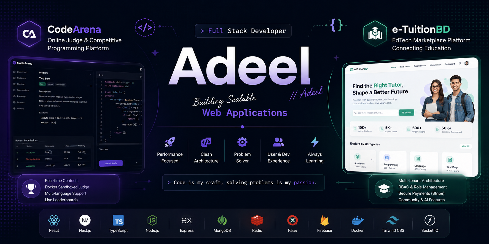

<div align="center">



<br/>


<br/>


</div>

---

## 🚀 About Me

```typescript
const adeel = {
  role: "Full Stack Developer",
  specialization: [
    "Frontend Architecture",
    "Scalable SaaS",
    "Developer Experience",
    "Performance Engineering"
  ],
  currentlyBuilding: ["CodeArena", "e-TuitionBD"],
  interests: ["System Design", "Clean Architecture", "Modern React", "Automation"],
  philosophy: "I build products that solve real problems with a focus on architecture, maintainability, and UX."
}
```

---

## 🛠️ Tech Stack

- **Frontend:** JavaScript, TypeScript, React, Next.js, HTML5, CSS3, Tailwind CSS, Sass
- **Backend & DB:** Python, Node.js, MongoDB, Redis, Firebase
- **DevOps & Tools:** Linux, Bash, Git, Docker

---

## 🔥 Featured Projects

<!--  ★  FLAGSHIP  ★  -->

<div align="center">

## ⚔️ CodeArena

### Full-Stack Online Judge & Competitive Programming Platform


&nbsp;

&nbsp;

&nbsp;


</div>

> A **production-grade competitive programming platform** built from the ground up as a 6-person team project. Users can browse problems, write and submit code in a Monaco editor, and get instant verdicts — powered by a real Docker sandboxed execution engine.

| Feature | Details |
|---|---|
| 🧑‍⚖️ **Online Judge** | Submits code to isolated Docker containers, evaluates against test cases, returns 10 possible verdicts |
| 🌐 **Multi-language** | C++, Python, Java, JavaScript — each with a dedicated executor Docker image |
| 🏆 **Contests** | Timed competitions with participant registration, live leaderboards & penalty scoring |
| 🔐 **Auth System** | Firebase + JWT dual-layer — HttpOnly cookie sessions protect against XSS |
| 🤖 **AI Integration** | Google Gemini & Groq SDK for intelligent platform features |
| ⚡ **Real-time** | Socket.IO + Redis adapter layer for live updates |
| 🛡️ **Security** | Docker socket proxied through `tecnativa/docker-socket-proxy` — restricted to safe APIs only |
| 📊 **Monitoring** | Prometheus-compatible metrics via `prom-client` |

**Stack:** `Next.js 16` · `React 19` · `Tailwind CSS v4` · `MongoDB` · `Redis` · `BullMQ` · `Docker + dockerode` · `Firebase Auth` · `JWT` · `Socket.IO` · `Monaco Editor` · `Three.js` · `Framer Motion` · `GSAP` · `Zod` · `SWR` · `Zustand`

<div align="center">

[](https://github.com/rabiulislam5334/CodeArena-TeamProject)
&nbsp;&nbsp;
[](https://codearena-pink.vercel.app/)

</div>


---

### 🎓 e-TuitionBD

<p align="center">
  
  
  
</p>

<p align="center">
A production-focused EdTech marketplace that connects students, tutors, parents, and educational organizations on a single platform. Built with scalable multi-tenant architecture, role-based permissions, secure payments, tuition lifecycle management, community features, and AI-powered workflows.
</p>

<p align="center">

| Feature | Details |
|---------|---------|
| 🎓 Tutor Marketplace | Search, filtering, applications, hiring workflow |
| 🏢 Organization Support | Coaching centers with multi-role management |
| 🔐 RBAC | Super Admin, Admin, Student, Tutor, Organization roles |
| 💳 Payment System | Secure payment flow with commission-ready architecture |
| 👥 Community | Educational discussions, engagement, collaboration |
| 🤖 AI Features | AI-assisted platform experiences and automation |
| 📈 Admin Dashboard | Analytics, moderation, reporting and management |
| ⚡ Scalable Backend | Designed using multi-tenant architecture and clean domain separation |

<strong>Tech:</strong> React 19 • Node.js • Express • MongoDB • Firebase Auth • JWT • Stripe • Socket.IO • Redis • Tailwind CSS • Framer Motion
</p>

<div align="center">

[](https://github.com/mdadeel/etuitionhub-frontend)
&nbsp;&nbsp;
[](https://e-tuitionhub.vercel.app/)

</div>

---

## 🎯 Current Focus & Philosophy

Currently building platforms like CodeArena and expanding my knowledge in advanced React patterns and system design. 
I believe in writing clean, documented code and prioritizing performance and user experience. 

---

## 📬 Let's Connect!

<div align="center">

[](https://www.linkedin.com/in/shahnawasadee1/)
[](https://mdadeel.me/)
[](https://github.com/mdadeel)
[](mailto:shahnawasadeel@gmail.com)

<br/>

**⭐ From [mdadeel](https://github.com/mdadeel) | Built with 💜 and ☕**

</div>
